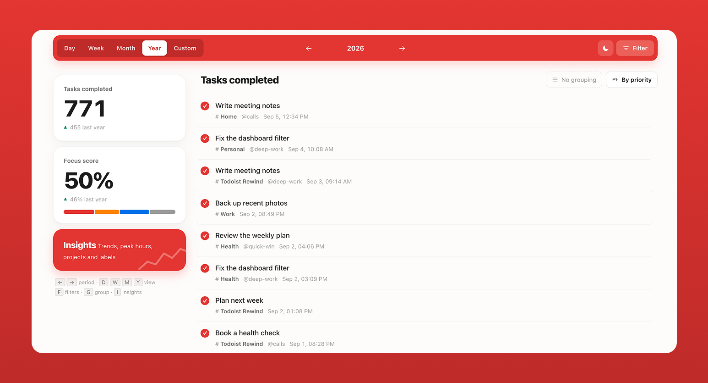
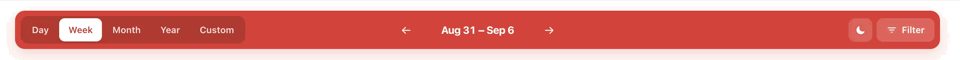
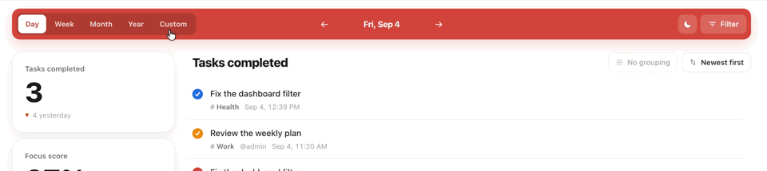
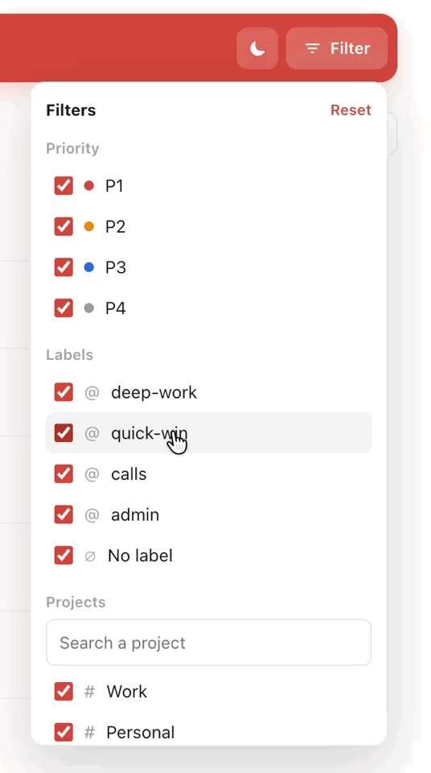
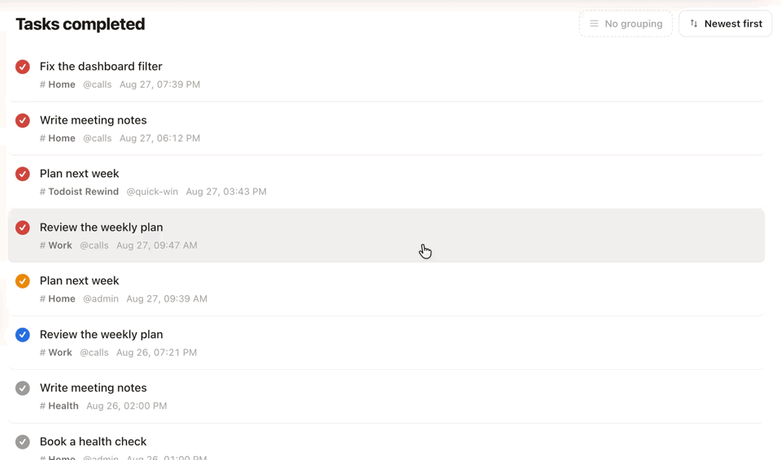
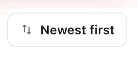
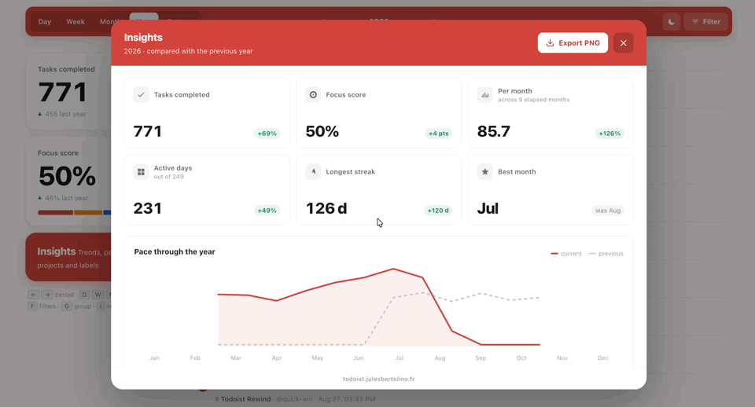
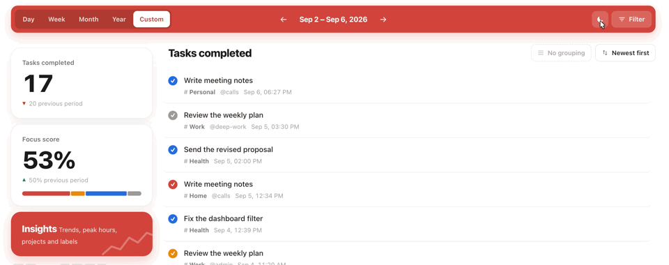

  
🎯

  <h1>Todoist Rewind</h1>
  
<strong>Your weekly review got an upgrade.</strong>

  

    <a href="https://todoist.julesbertolino.fr">Live app</a> •
    <a href="#about-the-project">About</a> •
    <a href="#getting-started">Getting started</a> •
    <a href="#contributing">Contributing</a> •
    <a href="CHANGELOG.md">Changelog</a>
  

  
  
  

---

## Contents

- [About the project](#about-the-project)
- [Navigate your history](#navigate-your-history)
- [Tasks logbook](#tasks-logbook)
- [Insights: understand your patterns](#insights-understand-your-patterns)
- [Quality-of-life details](#quality-of-life-details)
- [Privacy](#privacy)
- [Getting started](#getting-started)
- [Contributing](#contributing)
- [Contact / About me](#contact--about-me)
- [License](#license)

---

# About the project

Todoist is excellent at showing what is next, but reviewing completed work in its logbook can still feel cluttered and hard to read. Todoist Rewind turns it into a clear, private activity review: explore any period from a day to a custom range, filter and group completed tasks, then use contextual Insights to see where your attention went. Compare each period with the one before it, inspect projects, labels, and priority mix, and export the review as a PNG — all directly in your browser. Your Todoist token and data never leave your device.

🔗 **Live App:** [todoist.julesbertolino.fr](https://todoist.julesbertolino.fr)

---

# Navigate your history

Use the navigation bar to decide what you want to review before diving into the detail.

### Choose a time frame

Switch between Day, Week, Month, and Year, then move backward or forward through equivalent periods. The summary and Insights always compare the selected period with the one immediately before it.

### Create a custom range

Need a review that does not fit a calendar boundary? Set your own start and end dates. Once it is selected, the arrows move by that same span—ideal for sprints, holidays, or a project phase.

### Filter the review

Narrow the log by priority, project, label, or tasks without a label. The filter badge shows when a selection is active, and Reset restores the full view in one click.

# Tasks logbook

The log preserves the context that matters: each completed task keeps its project, labels, completion time, and priority.

### Group tasks your way

Choose the grouping that makes sense for the current period: day, week, month, project, or label. A weekly review can become a day-by-day story; a project review can become a clean handover.

### Sort and open a task

Switch between newest-first and priority sorting. When you need the original context, select a task to open it directly in Todoist.

# Insights: understand your patterns

Insights turns a task log into an honest review of where your attention went.

### Check the Focus Score

Focus Score is the share of completed tasks marked P1 or P2. It helps distinguish meaningful progress from a week spent only clearing low-priority busy work.

### Explore period-aware Insights

The dashboard changes with the selected period instead of forcing the same charts everywhere. It combines totals, comparisons, productive moments, pace, project distribution, labels, priority mix, and the metrics that make sense for that period—such as active days, best week, or longest streak.

### Export the review

Export the complete Insights sheet as a PNG whenever you want to keep, share, or revisit a snapshot of the period.

# Quality-of-life details

### Choose a theme

Todoist Rewind follows your system preference on first use and remembers your chosen light or dark theme locally.

### Keep your hands on the keyboard

Use the arrow keys to move between periods, `D` / `W` / `M` / `Y` to change the time frame, and `F`, `G`, or `I` to open filters, grouping, or Insights. The layout remains usable on mobile too.

---

# Privacy

Data is important and none of us want to trust a random tool with our API key and most private data.

**How it works:**
- ✅ The data never transits through any server
- ✅ Your API key is only stored locally in your browser
- ✅ When the app fetches tasks, it talks directly to Todoist's servers
- ✅ 100% client-side JavaScript
- ✅ No backend, no data collection
- ✅ The code is fully transparent and available right here

Don't take my word for granted—check the code yourself.

---

# Getting started

1. Grab your Todoist API key from Todoist Settings → Integrations
2. Open [Todoist Rewind](https://todoist.julesbertolino.fr) and paste your API key
3. Or try with demo data first if you're not ready

That's it. Your data loads directly from Todoist into your browser.

---

# Contributing

Want to improve Todoist Rewind? Here's how:

### Reporting Bugs
Found a bug? [Open an issue](https://github.com/julesvbertolino/todoist-rewind/issues/new) and describe:
- What happened
- What you expected
- Steps to reproduce
- Your browser/OS

### Suggesting Features
Have an idea? [Open an issue](https://github.com/julesvbertolino/todoist-rewind/issues/new) with:
- The feature description
- Why it would be useful
- Any mockups or examples

### Contributing Code
1. Fork this repository
2. Create a branch: `git checkout -b feature/your-feature-name`
3. Make your changes
4. Test thoroughly
5. Commit: `git commit -m "Add: your feature description"`
6. Push: `git push origin feature/your-feature-name`
7. Open a Pull Request

I'll review PRs as soon as I can. Please keep changes focused and test your code.

---

# Contact / About me

Todoist Rewind is made by [Jules Bertolino](https://julesbertolino.fr), an independent digital product designer and developer based in Antibes, France.

- Explore the live app: [todoist.julesbertolino.fr](https://todoist.julesbertolino.fr)
- See more work: [julesbertolino.fr](https://julesbertolino.fr)
- Support the project: [Buy me a coffee](https://buymeacoffee.com/julesbertolino)

---

# License

MIT License - feel free to fork, modify, and use this however you want.

See [LICENSE](LICENSE) for details.

---
